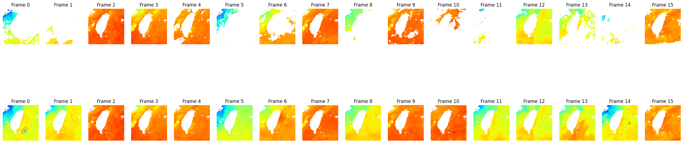

# U-Net Gap Filling for Satellite Imagery

This repository contains code implementation for the paper titled, "Leveraging Transfer Learning and U-Nets Method for Improved Gap Filling in Himawari Sea Surface Temperature Data Adjacent to Taiwan", published as a research article in the MDPI ISPRS International Journal of Geo-Information. The model is initially trained on a Himawari (L4) gap-free Sea Surface Temperature dataset and then fine-tuned using Himawari Sea Surface Temperature L3 data containing gaps.<br>

The paper can be found at this [link](https://www.mdpi.com/2220-9964/13/5/162).<br>

See the websites of our [Ocean Remote Sensing Lab](https://sites.google.com/view/hsupochun/ocean-lab?authuser=0)


## Overview

The U-Net architecture is a convolutional neural network (CNN) commonly used for image segmentation tasks. In this project, we utilize it to fill gaps in satellite imagery caused by cloud cover or other factors.



## Data

- **Himawari (L4) Gap-Free Sea Surface Temperature Dataset**: Initially, the model is trained on a dataset with no gaps to learn features from clean imagery.
- **Gap Data**: After obtaining the pre-trained model, it is fine-tuned using data containing gaps to specifically address the task of filling missing regions in satellite images.

## Usage

1. Clone the repository:

```bash
git clone https://github.com/Arcturion/unet-gap-filling.git
```

2. Go to the demo directory, then follow instructions there:


## Citation

If you find this code helpful for your research, please consider citing our paper
**BibTex:**
~~~LaTeX
@Article{ijgi13050162,
AUTHOR = {Putra, Dimas Pradana and Hsu, Po-Chun},
TITLE = {Leveraging Transfer Learning and U-Nets Method for Improved Gap Filling in Himawari Sea Surface Temperature Data Adjacent to Taiwan},
JOURNAL = {ISPRS International Journal of Geo-Information},
VOLUME = {13},
YEAR = {2024},
NUMBER = {5},
ARTICLE-NUMBER = {162},
URL = {https://www.mdpi.com/2220-9964/13/5/162},
ISSN = {2220-9964},
DOI = {10.3390/ijgi13050162}
}

~~~

**AMA Style:**
~~~python
Putra DP, Hsu P-C. Leveraging Transfer Learning and U-Nets Method for Improved Gap Filling in Himawari Sea Surface Temperature Data Adjacent to Taiwan. ISPRS International Journal of Geo-Information. 2024; 13(5):162. https://doi.org/10.3390/ijgi13050162
~~~
